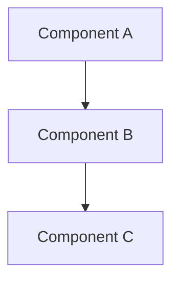

# Design: {{task_name}}

## Overview
<!-- One-paragraph summary of the approach -->

## Architecture

## Data Flow
<!-- How does data move through the system? -->

## Interfaces

| Interface | Input | Output | Notes |
|-----------|-------|--------|-------|
| ... | ... | ... | ... |

## Changes Required

### New Files
- `src/...`

### Modified Files
- `src/...`

## Risks & Mitigations
<!-- What could go wrong and how to handle it -->

## Test Plan
<!-- How will this be tested? -->

---

*Task: {{task_name}} | Project: {{project_name}}*
